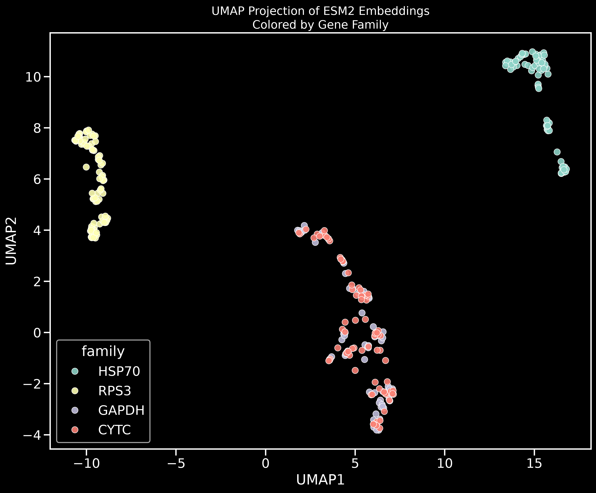
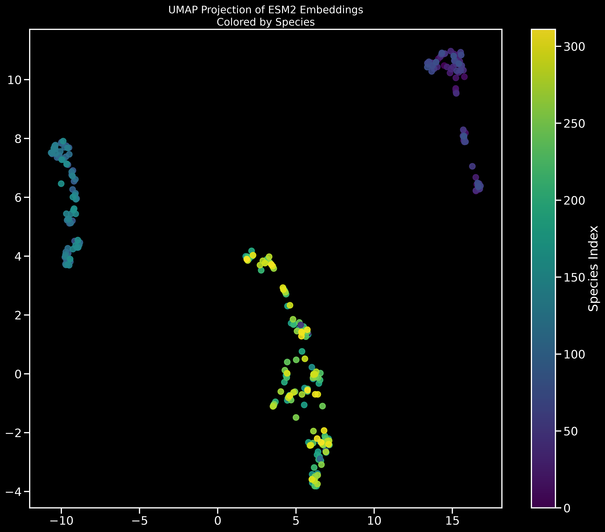
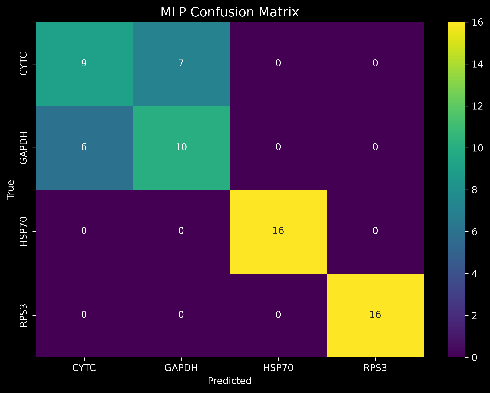

# Alignment-Free Phylogenomics Using Protein Language Model Embeddings

Exploring whether protein language model embeddings can recover evolutionary and functional relationships directly from protein sequences without requiring sequence alignment.

---

## Overview

Recent protein language models have demonstrated an ability to learn biologically meaningful representations from raw amino acid sequences. This project investigates whether embeddings generated by the ESM-2 protein language model preserve evolutionary and functional signals that are traditionally studied using alignment-based phylogenetic approaches.

Using orthologous protein families obtained from OrthoDB, protein sequences were embedded into a high-dimensional representation space using ESM-2. The resulting embeddings were analyzed through dimensionality reduction, supervised classification, and within-family clustering to evaluate how effectively protein families can be distinguished without sequence alignment.

---

## Methods

### Dataset

Protein sequences were collected from OrthoDB and grouped into four conserved gene families:

- HSP70
- RPS3
- GAPDH
- Cytochrome C

A total of **320 protein sequences** were sampled across diverse taxa, with approximately **80 sequences per family**.

### Protein Embeddings

Embeddings were generated using:

- **Model:** ESM-2 (esm2_t6_8M_UR50D)
- **Embedding Dimension:** 320
- **Pooling Strategy:** Mean pooling of final-layer token representations

### Dimensionality Reduction

Embedding vectors were projected into two dimensions using UMAP:

- n_neighbors = 15
- min_dist = 0.1
- metric = cosine

### Classification

To assess whether family information is encoded within the embeddings, a multilayer perceptron (MLP) classifier was trained using:

- Hidden layers: (256, 128)
- Stratified 80/20 train-test split
- Family labels as ground truth

Performance was compared against a majority-class baseline classifier.

### Within-Family Clustering

KMeans clustering (k = 2 and k = 3) was applied separately within each gene family. Sequences belonging to small minority clusters were flagged as embedding outliers for exploratory analysis of within-family heterogeneity.

---

## Results

### Embedding-Based Classification

| Model          | Accuracy |
| -------------- | -------- |
| Dummy Baseline | 25.0%    |
| ESM-2 + MLP    | 79.7%    |

The classifier substantially outperformed the baseline, demonstrating that ESM-2 embeddings encode strong family-level biological information directly from protein sequences.

### Family-Specific Performance

| Family       | Precision | Recall | F1-score |
| ------------ | --------- | ------ | -------- |
| HSP70        | 1.00      | 1.00   | 1.00     |
| RPS3         | 1.00      | 1.00   | 1.00     |
| GAPDH        | 0.59      | 0.62   | 0.61     |
| Cytochrome C | 0.60      | 0.56   | 0.58     |

HSP70 and RPS3 formed highly separable clusters in embedding space, while GAPDH and Cytochrome C exhibited partial overlap.

---

## Embedding Space Visualization

### UMAP Colored by Gene Family



Protein sequences cluster primarily according to gene family, indicating that ESM-2 embeddings capture biologically meaningful sequence relationships without requiring multiple sequence alignment.

### UMAP Colored by Species



When colored by species identity, clustering remains dominated by gene family structure rather than taxonomic grouping, suggesting that functional and evolutionary information is strongly represented in the learned embeddings.

---

## Classification Performance



The confusion matrix shows near-perfect recovery of HSP70 and RPS3 proteins. Most classification errors occur between GAPDH and Cytochrome C, consistent with their partial overlap in embedding space.

---

## Embedding Outlier Detection

Within-family KMeans clustering identified a small number of sequences occupying atypical regions of embedding space. These sequences may represent highly divergent homologs, lineage-specific adaptations, or potential annotation artifacts.

Detected outliers included:

- 1 sequence in Cytochrome C
- 1 sequence in GAPDH
- 4 sequences in HSP70
- 11 sequences in RPS3

Results were exported to:

```text
results/paralog_candidates.csv
```

---

## Repository Structure

```text
esm2-phylogenomics/
│
├── data/
│   ├── HSP70.fasta
│   ├── RPS3.fasta
│   ├── GAPDH.fasta
│   └── CYTC.fasta
│
├── output/
│   ├── all_families.fasta
│   ├── embeddings.npy
│   └── metadata.csv
│
├── plots/
│   ├── umap_by_family.png
│   ├── umap_by_species.png
│   └── confusion_matrix.png
│
├── results/
│   └── paralog_candidates.csv
│
├── dataset_prepare.py
├── generate_embeddings.py
├── cluster_and_visualize.py
├── train_mlp_classifier.py
├── detect_paralogs.py
└── README.md
```

---

## Key Finding

The results demonstrate that protein language model embeddings capture biologically meaningful structure directly from amino acid sequences. Without performing sequence alignment or explicitly modeling evolutionary relationships, ESM-2 embeddings were able to separate major protein families and support accurate downstream classification.

These findings suggest that protein language models provide a promising alignment-free framework for exploratory comparative genomics and phylogenomics, particularly in settings where traditional alignment-based approaches become computationally expensive or difficult to scale.

---

## Future Directions

Potential extensions include:

- Expanding to a larger set of orthologous gene families
- Comparing embedding-based clustering against classical phylogenetic trees
- Evaluating additional protein language models
- Investigating gene-tree/species-tree discordance using embedding distances
- Exploring alignment-free approaches for large-scale phylogenomic analysis
