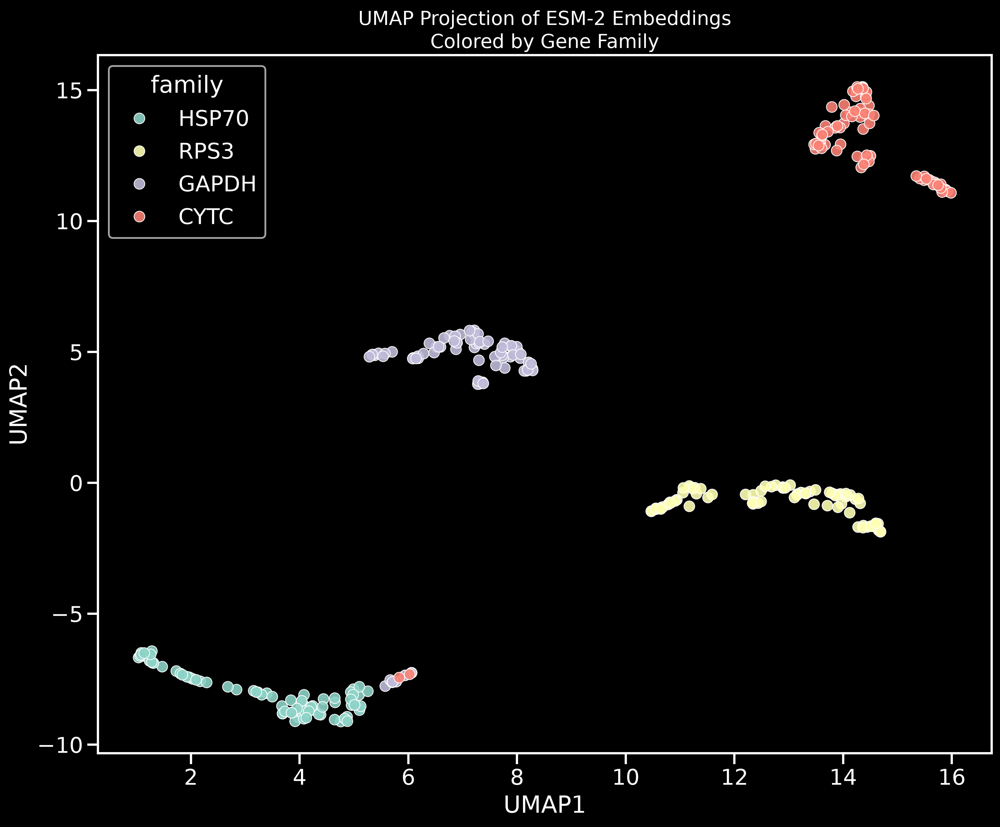
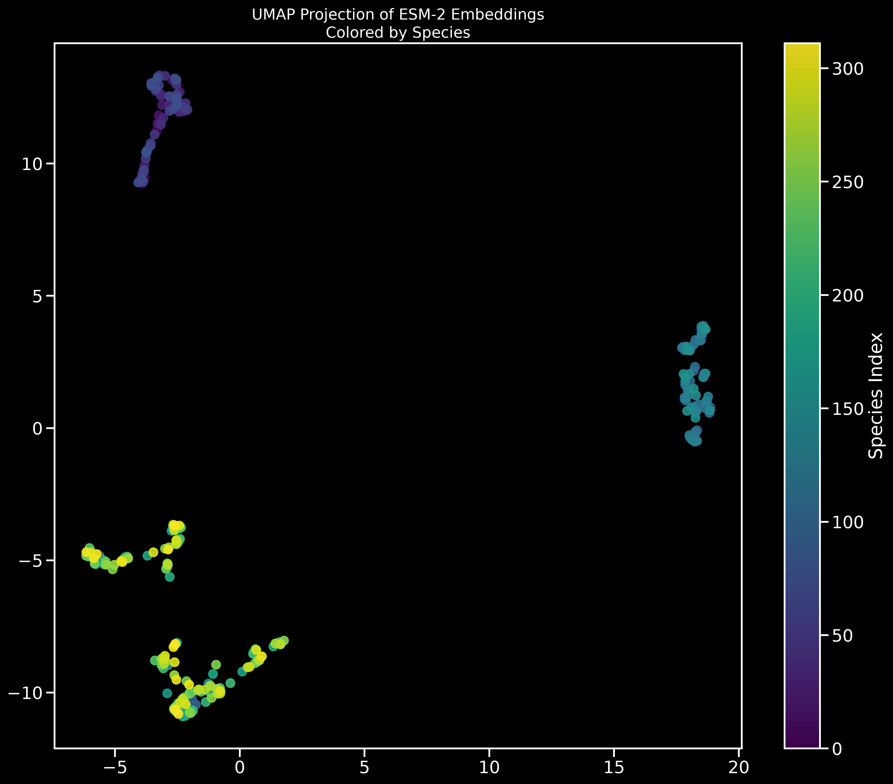
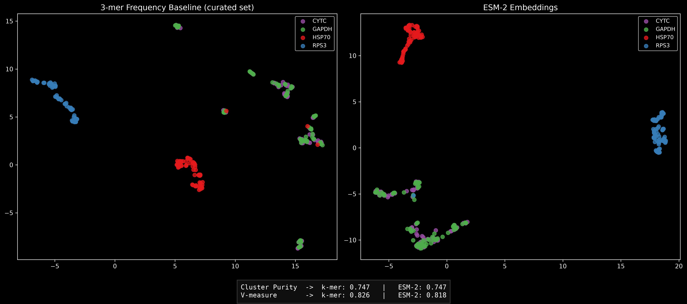

# Alignment-Free Phylogenomics Using Protein Language Model Embeddings

> **v0.2.0 upgrade notice:** this pipeline was refactored for correctness,
> statistical rigor, and reproducibility (see [CHANGELOG.md](CHANGELOG.md)
> for full details). All numbers below are from a real rerun of the fixed
> pipeline (`esm2_t12_35M_UR50D`, the new default checkpoint), not the
> original pre-fix results. Two things changed materially as a result:
> classifier accuracy is now reported via 5-fold cross-validation instead of
> a single lucky train/test split, and the k-mer-vs-ESM-2 comparison —
> previously invalid due to a dataset-mismatch bug — now shows the k-mer
> baseline slightly _ahead_ of this ESM-2 checkpoint, motivating a larger
> model as next step (see Biological Interpretation).

## Overview

Phylogenomic analyses traditionally rely on multiple sequence alignment and evolutionary models to infer relationships between genes and species. Recent protein language models, however, learn rich sequence representations directly from large-scale protein databases and may encode evolutionary information without requiring explicit alignment.

This project investigates whether embeddings generated by the ESM-2 protein language model can recover biologically meaningful structure from protein sequences in an alignment-free setting. Using orthologous proteins sampled from OrthoDB, I compare learned ESM-2 embeddings against a classical alignment-free baseline based on k-mer composition and evaluate their ability to recover gene family structure through visualization, clustering, classification, and outlier detection.

---

## Quickstart

```bash
pip install -r requirements.txt

# Run every stage in order:
python run_pipeline.py

# Or run stages individually:
python dataset_prepare.py              # curate data/ -> output/all_families.fasta
python generate_embeddings.py          # -> output/embeddings.npy, output/metadata.csv
python cluster_visualise.py            # -> plots/umap_by_family.png, umap_by_species.png
python train_mlp_classifier.py         # -> plots/confusion_matrix.png, classifier_metrics.json
python detect_paralogs.py              # -> results/paralog_candidates.csv
python kmer_distance.py                # -> plots/kmer_vs_esm2.png

# Optional: gene-tree vs species-tree comparison (see "Tree Comparison" below)
python build_gene_trees.py
python compare_trees.py                # needs results/species.tree supplied separately

# Run the test suite (pure-logic tests, no GPU/model weights needed):
pytest tests/
```

Every script accepts `--help` for its CLI options (model size, output paths,
hyperparameters, etc). By default all scripts read/write the same
`data/`, `output/`, `plots/`, `results/` layout described below.

**On GPUs:** `generate_embeddings.py --device auto` (the default) uses CUDA
if available and otherwise falls back to CPU. Note that torch's CUDA
backend only supports NVIDIA GPUs — an AMD integrated GPU (e.g. a Radeon
chip on Windows) will not be used; the script will silently run on CPU,
which is fine for the model sizes here (8M–150M parameters).

---

## Comparing Runs

Every stage script accepts `--embeddings`, `--metadata`, `--plots-dir`, and
`--results-dir` overrides, so you can archive a full run's outputs before
starting the next one (e.g. to compare two ESM-2 model sizes) instead of
overwriting them:

```bash
# after finishing a run on esm2_t12_35M_UR50D
mkdir -p runs/esm2_t12_35M
mv output/embeddings.npy output/metadata.csv runs/esm2_t12_35M/
mv plots/* results/* runs/esm2_t12_35M/

# rerun with a bigger checkpoint
python generate_embeddings.py --model esm2_t30_150M_UR50D
python cluster_visualise.py
python train_mlp_classifier.py
python detect_paralogs.py
python kmer_distance.py

mkdir -p runs/esm2_t30_150M
mv output/embeddings.npy output/metadata.csv runs/esm2_t30_150M/
mv plots/* results/* runs/esm2_t30_150M/

# compare the two runs: prints a table and saves a bar chart
python compare_runs.py --run-a runs/esm2_t12_35M --run-b runs/esm2_t30_150M
```

`compare_runs.py` reads `classifier_metrics.json` and
`kmer_vs_esm2_metrics.json` from each archived run directory and produces
`plots/run_comparison.png` plus a console table covering CV accuracy,
macro-F1, and both methods' cluster purity/V-measure — so you don't have
to eyeball two separate README sections to see what changed.

---

## Dataset

Protein sequences were obtained from OrthoDB [9] and grouped into four conserved gene families spanning diverse eukaryotic taxa:

- HSP70 (Heat Shock Protein 70)
- RPS3 (Ribosomal Protein S3)
- GAPDH (Glyceraldehyde-3-Phosphate Dehydrogenase)
- Cytochrome C

The final dataset contained:

| Family       | Sequences |
| ------------ | --------: |
| HSP70        |        80 |
| RPS3         |        80 |
| GAPDH        |        80 |
| Cytochrome C |        80 |
| **Total**    |   **320** |

Headers were reformatted to preserve family labels in the form:

```text
>HSP70|Homo_sapiens
>RPS3|Arabidopsis_thaliana
```

These labels were used as ground truth throughout the analysis.

---

## Methods

### Protein Language Model Embeddings

Protein representations are generated using ESM-2 [1]. The model checkpoint is
now configurable via `generate_embeddings.py --model`:

| Checkpoint            | Params | Embedding dim | Notes                                            |
| --------------------- | -----: | ------------: | ------------------------------------------------ |
| `esm2_t6_8M_UR50D`    |     8M |           320 | Fastest on CPU; original default                 |
| `esm2_t12_35M_UR50D`  |    35M |           480 | New default — better signal, still CPU-tractable |
| `esm2_t30_150M_UR50D` |   150M |           640 | Noticeably slower on CPU                         |
| `esm2_t33_650M_UR50D` |   650M |          1280 | GPU recommended                                  |
| `esm2_t36_3B_UR50D`   |     3B |          2560 | Large-memory GPU required                        |

Pooling strategy: mean pooling of final-layer token representations. Each
sequence is converted into a fixed-length embedding vector suitable for
downstream machine learning analyses.

### Dimensionality Reduction

To visualize embedding structure, UMAP [2] was applied with:

- n_neighbors = 15
- min_dist = 0.1
- metric = cosine

### Classification

A multilayer perceptron (MLP) classifier was trained to predict protein family labels from ESM-2 embeddings:

- Hidden layers: (256, 128)
- Embeddings standardized before training (zero mean, unit variance)
- **Headline metric: stratified 5-fold cross-validated accuracy and macro-F1
  (mean ± std)**, since a single 80/20 split (64 test sequences) is a noisy
  point estimate — one misclassified sequence moves accuracy by >1.5 points.
- A single 80/20 stratified split is still produced, but only to render one
  illustrative confusion matrix, not as the reported metric.
- Baseline: majority-class dummy classifier, also cross-validated.

### Embedding Outlier Detection

Two complementary signals are combined per family:

1. **KMeans minority cluster** (original heuristic): KMeans (k = 2 and k = 3)
   applied separately within each family; sequences in clusters representing
   fewer than 20% of family members are flagged. Note this heuristic _always_
   flags something for any family, by construction of k-means with k>1.
2. **Robust z-score distance from centroid** (new): a sequence's cosine
   distance to its family's embedding centroid is converted to a robust
   z-score (median/MAD-based), so it isn't itself skewed by the outliers it's
   trying to detect. Unlike (1), this can legitimately flag zero sequences.

Sequences flagged by _both_ signals are reported as high-confidence
candidates; flagged by only one, as low-confidence.

### Alignment-Free Baseline

As a classical alignment-free baseline [4], each protein was represented by normalized 3-mer amino acid frequencies.

- k = 3
- 20 standard amino acids
- cosine distance
- agglomerative clustering

This baseline captures local sequence composition but contains no learned biological information.

---

## Results

### Embedding-Based Classification

| Metric                                            |            Value |
| ------------------------------------------------- | ---------------: |
| Dummy Baseline (5-fold CV)                        |            25.0% |
| **ESM-2 + MLP (5-fold CV, mean ± std)**           | **72.2% ± 2.7%** |
| ESM-2 + MLP (single hold-out split, illustrative) |            79.7% |

The cross-validated accuracy (72.2%) is the number to trust — it's the mean
over 5 stratified folds, so it isn't sensitive to which 64 sequences
happened to land in a single test split. The single-split number (79.7%,
kept for the confusion matrix below) is noticeably higher purely by chance;
the fold-to-fold range was 68.8%–76.6%. Either way, the ESM-2 classifier
substantially outperforms the 25% dummy baseline, indicating that protein
family identity is strongly encoded within the learned embedding space.

### Family-Specific Performance

(from the single illustrative hold-out split, n=64)
[(runs/esm2_t30_150M/confusion_matrix.png)]

| Family       | Precision | Recall | F1-score |
| ------------ | --------: | -----: | -------: |
| HSP70        |      1.00 |   1.00 |     1.00 |
| RPS3         |      1.00 |   1.00 |     1.00 |
| GAPDH        |      0.59 |   0.62 |     0.61 |
| Cytochrome C |      0.60 |   0.56 |     0.58 |

HSP70 and RPS3 were recovered almost perfectly, whereas GAPDH and Cytochrome C exhibited partial overlap in embedding space.

---

## Embedding Space Visualization

Shown below: `esm2_t30_150M_UR50D` (the larger, more recent run). The
`esm2_t12_35M_UR50D` version is archived at
[`runs/esm2_t12_35M/`](runs/esm2_t12_35M/) for comparison.

### UMAP Colored by Gene Family



Distinct clustering by gene family emerges directly from ESM-2 embeddings despite the absence of alignment or phylogenetic information during training.

### UMAP Colored by Species



## When colored by species identity, clustering remains dominated by protein family rather than taxonomy. This suggests that ESM-2 primarily captures functional and evolutionary constraints encoded in protein sequences.

## Alignment-Free Baseline Comparison

To evaluate whether ESM-2 embeddings provide information beyond simple sequence composition, embeddings were compared against a classical alignment-free baseline using normalized 3-mer frequency vectors, on the **identical 320-sequence curated dataset** for both methods (see CHANGELOG — the original comparison had a dataset-mismatch bug and is no longer used).

### Model Size Comparison

Full archived outputs for each run: [`runs/esm2_t12_35M/`](runs/esm2_t12_35M/), [`runs/esm2_t30_150M/`](runs/esm2_t30_150M/). Generated with `compare_runs.py`:


| Metric               | `esm2_t12_35M`\* | `esm2_t30_150M` | k-mer baseline |
| -------------------- | ---------------: | --------------: | -------------: |
| MLP CV accuracy      |            72.2% |           74.7% |              — |
| MLP CV macro-F1      |            0.713 |           0.743 |              — |
| ESM-2 cluster purity |            0.741 |       **0.747** |          0.747 |
| ESM-2 V-measure      |            0.754 |       **0.818** |          0.826 |

\* The 35M run's clustering numbers (purity/V-measure) predate a
clustering-methodology fix described below and are not fully apples-to-apples
with the 150M numbers — see the note underneath the table.

`compare_runs.py --run-a runs/esm2_t12_35M --run-b runs/esm2_t30_150M` reproduces this table and chart from the archived JSON metrics in each run folder.

**150M essentially ties the k-mer baseline on cluster purity and nearly
closes the gap on V-measure**, a meaningful jump from 35M. Classification
accuracy improved by a smaller but consistent margin (+2.5 points), which
makes sense: classification and clustering purity aren't measuring the same
thing — the MLP can learn a nonlinear decision boundary on top of the same
embeddings, while clustering only uses their raw geometric structure.

> **Note on embedding geometry:** mean-pooled transformer embeddings are
> known to exhibit a large shared ("anisotropic") direction common to
> nearly all sequences, which can dominate cosine-distance-based clustering
> and mask smaller per-family signal riding on top of it [5, 6]. An earlier
> version of this comparison also clustered the k-mer baseline
> (agglomerative + cosine) and the ESM-2 embeddings (KMeans + Euclidean)
> with _different_ algorithms on different distance geometries — not a fair
> comparison. This pipeline's clustering step now uses agglomerative +
> cosine for both methods, with embeddings mean-centered first to correct
> for anisotropy. Both fixes are reflected in the 150M numbers above; the
> archived 35M run predates them, which is why it's flagged with an
> asterisk rather than presented as a clean three-way comparison.

### UMAP Comparison: 3-mer Baseline vs ESM-2 (150M)



## The left panel shows UMAP projections of normalized 3-mer frequency vectors. The right panel shows `esm2_t30_150M_UR50D` embeddings of the same 320 proteins — consistent with the near-parity purity/V-measure numbers above, family separation is visibly tighter here than in the earlier 35M version.

## Biological Interpretation

The overlap between GAPDH, Cytochrome C, and RPS3 in the ESM-2 (35M) UMAP projection is the most interesting observation in this run.

GAPDH and Cytochrome C are both ancient, highly conserved housekeeping proteins that have evolved under strong functional constraint across eukaryotes. GAPDH functions in glycolysis, while Cytochrome C serves as an electron carrier in oxidative phosphorylation. Despite their distinct biological roles, both exhibit limited sequence divergence relative to proteins such as HSP70 — and the classifier's family-specific F1 scores (1.00 for HSP70/RPS3 vs. ~0.6 for GAPDH/Cytochrome C in the illustrative split) tell a consistent story.

At this checkpoint size, ESM-2 appears to encode conservation and functional constraint as a dominant signal, and that signal doesn't yet clearly dominate the classical k-mer composition baseline on purity/V-measure. This highlights an important, checkpoint-size-dependent question in comparative genomics: whether a protein language model's advantage over composition-based methods requires a larger model to manifest for these particular families, or whether these specific housekeeping proteins are just intrinsically hard to separate without structural or domain-level information.

---

## Embedding Outlier Detection

Within-family analysis now combines two signals per sequence (see CHANGELOG):
the original KMeans-minority-cluster heuristic (which by construction always
flags _something_), and a robust z-score distance from each family's
embedding centroid (which can legitimately flag zero sequences). A sequence
flagged by **both** is reported as high-confidence.

| Family       | Total | KMeans-flagged | Robust-Z-flagged | High-confidence |
| ------------ | ----: | -------------: | ---------------: | --------------: |
| Cytochrome C |    80 |              1 |                7 |               1 |
| GAPDH        |    80 |              1 |                7 |               1 |
| HSP70        |    80 |             27 |                5 |               5 |
| RPS3         |    80 |              2 |                6 |               2 |

HSP70's high KMeans count (27/80) is a large fraction, but the high-confidence
column (5, i.e. agreed on by both methods) is the more trustworthy signal, and
is itself biologically plausible: HSP70 is a well-documented multi-paralog
family in eukaryotes (distinct cytosolic, ER/BiP, and mitochondrial/mortalin
isoforms), so real substructure within an 80-sequence, multi-species HSP70
sample is expected rather than anomalous. These 5 high-confidence sequences
are reasonable candidates for manual follow-up (e.g. checking which
organelle-targeted isoform each represents).

Results are available in:

```text
results/paralog_candidates.csv          # per-family summary
results/paralog_candidates_detail.csv   # per-sequence flags
```

---

## Repository Structure

> Archived per-model-size run outputs live under `runs/<model_name>/`
> (see "Comparing Runs" above). `output/`, `plots/`, and `results/` always
> reflect only the _most recently executed_ pipeline run.

```text
esm2-phylogenomics/
│
├── data/                       # raw OrthoDB FASTA files
├── output/
│   ├── all_families.fasta
│   ├── embeddings.npy
│   └── metadata.csv
│
├── plots/
│   ├── umap_by_family.png
│   ├── umap_by_species.png
│   ├── confusion_matrix.png
│   ├── kmer_vs_esm2.png
│   └── rf_distances.png        # if tree comparison is run
│
├── results/
│   ├── paralog_candidates.csv
│   ├── paralog_candidates_detail.csv
│   ├── <FAMILY>.tree           # gene trees (build_gene_trees.py)
│   ├── species.tree            # you supply this (see Tree Comparison)
│   └── rf_distances.csv
│
├── esm2_phylo/                 # shared package
│   ├── config.py               # paths, family labels, hyperparameter defaults
│   ├── logging_utils.py
│   └── utils.py                # pure functions (unit tested)
│
├── tests/
│   └── test_utils.py
│
├── dataset_prepare.py
├── generate_embeddings.py
├── cluster_visualise.py
├── train_mlp_classifier.py
├── detect_paralogs.py
├── kmer_distance.py
├── build_gene_trees.py         # NEW - finishes the tree-comparison feature
├── fetch_species_tree.py       # NEW - helper to build a species tree
├── compare_trees.py
├── check.py
├── run_pipeline.py             # NEW - orchestrates all stages
├── requirements.txt
├── pyproject.toml
├── CHANGELOG.md
└── readme.md
```

---

## Tree Comparison (Gene Tree vs Species Tree)

This compares each family's gene tree against a reference species tree via
normalized Robinson-Foulds (RF) distance [8], to ask: does the topology implied
by ESM-2 embedding distances agree with the accepted species phylogeny?

1. **Build gene trees from embeddings** (no MSA needed — uses
   neighbor-joining [7] on embedding cosine distances):

```bash
   python build_gene_trees.py
```

2. **Supply a species tree** (`results/species.tree`, Newick, leaf names =
   species names in the same underscored format as elsewhere, e.g.
   `Homo_sapiens`). Either:
   - run `python fetch_species_tree.py` (builds one from NCBI taxonomy —
     requires internet access), or
   - provide your own, e.g. downloaded from [TimeTree.org](https://timetree.org)
     or [Open Tree of Life](https://opentreeoflife.github.io/).
3. **Compare:**

```bash
   python compare_trees.py
```

This is a fast, alignment-free approximation — not a substitute for proper
ML/Bayesian gene-tree inference — but it's a natural extension of the
project's alignment-free premise and directly testable against the same
embeddings used elsewhere in this analysis.

---

## Known Limitations

- Gene trees from `build_gene_trees.py` are neighbor-joining trees built on
  embedding distances, a fast approximation rather than a substitute for
  proper phylogenetic inference (e.g. ML methods on an actual alignment).
- Cross-validated classifier accuracy is still computed on 320 sequences
  total (80/family) — a small dataset by ML standards. Expanding to more
  families/sequences would tighten the confidence intervals further.
- `extract_species()` falls back to `"Unknown_species"` for headers it can't
  parse; multiple such records collapse into one during deduplication
  (`dataset_prepare.py` now warns when this happens).
- See [CHANGELOG.md](CHANGELOG.md) for the full list of fixes made in this
  upgrade pass.

---

## Key Findings

- ESM-2 embeddings recover biologically meaningful protein family structure without sequence alignment — HSP70 and RPS3 in particular are nearly perfectly separable.
- Protein family identity can be predicted from embeddings with **72.2% ± 2.7% (5-fold CV) accuracy**, substantially exceeding the 25% random baseline.
- With the baseline comparison bug fixed (both methods evaluated on the identical 320-sequence set), the classical 3-mer composition baseline slightly **outperforms** this ESM-2 checkpoint (`esm2_t12_35M_UR50D`) on cluster purity and V-measure — motivating a follow-up run with a larger ESM-2 checkpoint.
- Conserved housekeeping proteins such as GAPDH and Cytochrome C remain challenging to separate from each other and from RPS3 at this model size, suggesting that functional constraint can dominate embedding geometry.
- Combining two outlier-detection signals surfaces 5 high-confidence HSP70 candidates for follow-up, consistent with HSP70's known multi-paralog (cytosolic/ER/mitochondrial) biology.

---

## Future Directions

Potential extensions include:

- Expanding the analysis to additional orthologous families.
- Evaluating larger protein language models (ESM-2 650M, ESM-2 3B) — now a
  one-flag change via `generate_embeddings.py --model`.
- ~~Comparing embedding distances against phylogenetic tree distances~~ —
  addressed in this upgrade via `build_gene_trees.py` + `compare_trees.py`
  (RF distance between embedding-derived gene trees and a species tree).
  Remaining work: validate against a curated (not just NCBI-default-topology)
  species tree, and compare against ML gene trees from a real alignment as a
  stronger baseline than the NJ approximation used here.
- Incorporating structural embeddings and domain annotations.
- Developing graph-based approaches for ortholog and paralog detection.

---

## References

1. Lin, Z., Akin, H., Rao, R., Hie, B., Zhu, Z., Lu, W., Smetanin, N., Verkuil, R., Kabeli, O., Shmueli, Y., dos Santos Costa, A., Fazel-Zarandi, M., Sercu, T., Candido, S., Rives, A. (2023). Evolutionary-scale prediction of atomic-level protein structure with a language model. _Science_, 379(6637), 1123–1130. https://doi.org/10.1126/science.ade2574

2. McInnes, L., Healy, J., Melville, J. (2018). UMAP: Uniform Manifold Approximation and Projection for Dimension Reduction. _arXiv:1802.03426_. https://arxiv.org/abs/1802.03426

3. Rosenberg, A., Hirschberg, J. (2007). V-Measure: A Conditional Entropy-Based External Cluster Evaluation Measure. In _Proceedings of the 2007 Joint Conference on EMNLP-CoNLL_, 410–420. https://aclanthology.org/D07-1043/

4. Zielezinski, A., Vinga, S., Almeida, J., Karlowski, W.M. (2017). Alignment-free sequence comparison: benefits, applications, and tools. _Genome Biology_, 18, 186. https://doi.org/10.1186/s13059-017-1319-7

5. Ethayarajh, K. (2019). How Contextual are Contextualized Word Representations? Comparing the Geometry of BERT, ELMo, and GPT-2 Embeddings. In _Proceedings of EMNLP-IJCNLP 2019_, 55–65. https://aclanthology.org/D19-1006/

6. Mu, J., Viswanath, P. (2018). All-but-the-Top: Simple and Effective Postprocessing for Word Representations. _International Conference on Learning Representations (ICLR) 2018_. https://arxiv.org/abs/1702.01417

7. Saitou, N., Nei, M. (1987). The neighbor-joining method: a new method for reconstructing phylogenetic trees. _Molecular Biology and Evolution_, 4(4), 406–425. https://doi.org/10.1093/oxfordjournals.molbev.a040454

8. Robinson, D.F., Foulds, L.R. (1981). Comparison of phylogenetic trees. _Mathematical Biosciences_, 53(1–2), 131–147. https://doi.org/10.1016/0025-5564(81)90043-2

9. Kuznetsov, D., Tegenfeldt, F., Manni, M., Seppey, M., Berkeley, M., Kriventseva, E.V., Zdobnov, E.M. (2023). OrthoDB v11: annotation of orthologs in the widest sampling of organismal diversity. _Nucleic Acids Research_, 51(D1), D445–D451. https://doi.org/10.1093/nar/gkac998

### Technologies

Python • BioPython • PyTorch • ESM-2 • Scikit-learn • UMAP • NumPy • Pandas • Matplotlib
