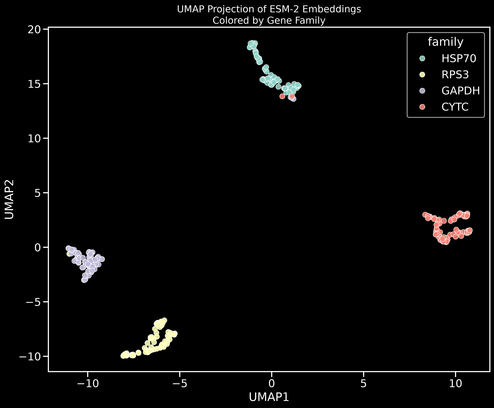
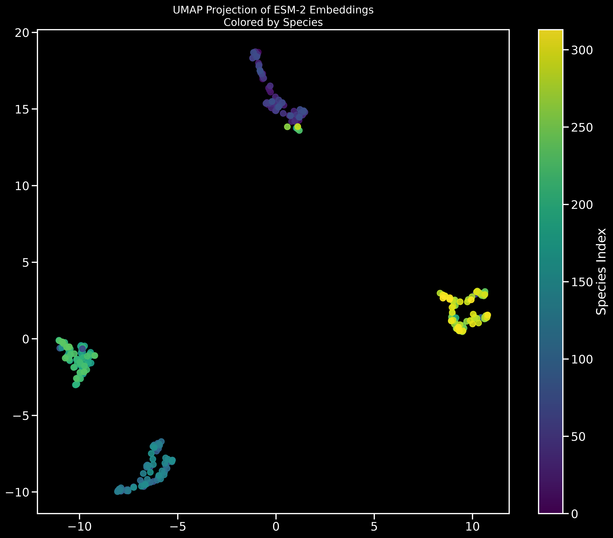
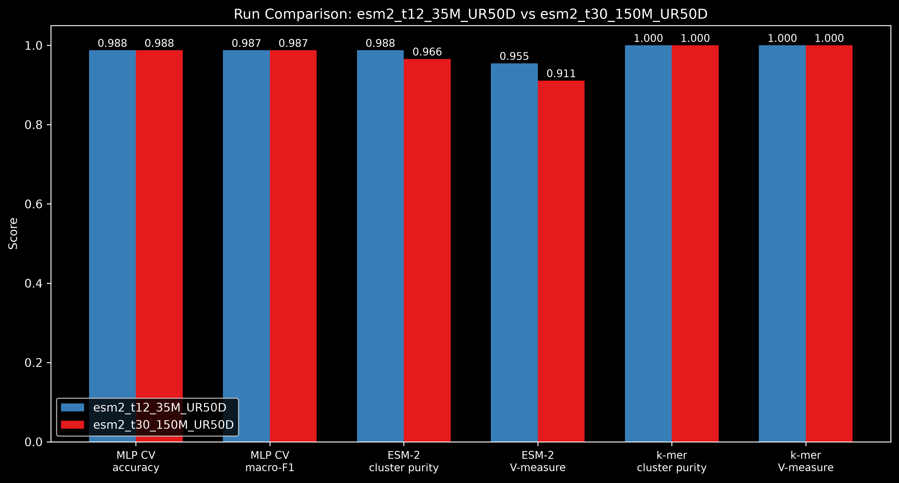
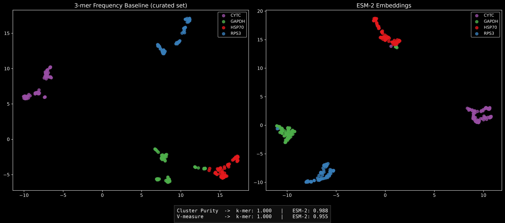
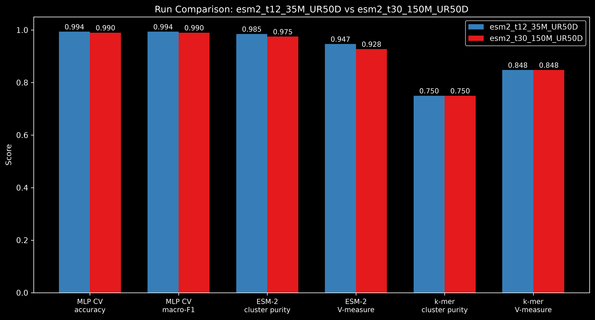

# Alignment-Free Phylogenomics Using Protein Language Model Embeddings

> **v0.2.1 data-integrity notice:** an earlier version of this project's raw
> data had `data/CYT_C.fasta` and `data/GAPDH.fasta` as **byte-identical
> files** — both were actually an unrelated "inositol-3-phosphate synthase"
> gene family mislabeled as two different families. Every "GAPDH" and
> "Cytochrome C" result prior to this fix (including the entire
> "Biological Interpretation" narrative about convergent evolution between
> the two) was an artifact of that bug, not a real biological finding, and
> has been retracted and rewritten below. Correct ortholog groups were
> re-sourced from [OrthoDB](https://www.orthodb.org) (search by gene
> symbol, e.g. `CYCS` for cytochrome c — searching the descriptive name
> alone repeatedly surfaced the wrong, similarly-named cytochrome c
> oxidase genes instead). See [CHANGELOG.md](CHANGELOG.md) for the full
> history, including the earlier v0.2.0 pipeline/statistics fixes.

## Overview

Phylogenomic analyses traditionally rely on multiple sequence alignment and evolutionary models to infer relationships between genes and species. Recent protein language models, however, learn rich sequence representations directly from large-scale protein databases and may encode evolutionary information without requiring explicit alignment.

This project investigates whether embeddings generated by the ESM-2 protein language model can recover biologically meaningful structure from protein sequences in an alignment-free setting. Using orthologous proteins sampled from OrthoDB, I compare learned ESM-2 embeddings against a classical alignment-free baseline based on k-mer composition and evaluate their ability to recover gene family structure through visualization, clustering, classification, and outlier detection.

---

## Quickstart

```bash
pip install -r requirements.txt

# Run every stage in order:
python run_pipeline.py

# Or run stages individually:
python dataset_prepare.py              # curate data/ -> output/all_families.fasta
python generate_embeddings.py          # -> output/embeddings.npy, output/metadata.csv
python run_pipeline.py --skip dataset embeddings   # runs visualize -> classify -> paralogs -> kmer

# Optional: gene-tree vs species-tree comparison (see "Tree Comparison" below)
python build_gene_trees.py
python compare_trees.py                # needs results/species.tree supplied separately

# Run the test suite (pure-logic tests, no GPU/model weights needed):
pytest tests/
```

Every script accepts `--help` for its CLI options (model size, output paths,
hyperparameters, etc). By default all scripts read/write the same
`data/`, `output/`, `plots/`, `results/` layout described below.

**On GPUs:** `generate_embeddings.py --device auto` (the default) uses CUDA
if available and otherwise falls back to CPU. Note that torch's CUDA
backend only supports NVIDIA GPUs — an AMD integrated GPU (e.g. a Radeon
chip on Windows) will not be used; the script will silently run on CPU.
**Memory note:** the 650M-parameter checkpoint requires several GB of free
RAM just to deserialize the model and can crash with a hard segfault
(rather than a graceful out-of-memory error) on machines with limited free
memory — see Known Limitations.

---

## Comparing Runs

Every stage script accepts `--embeddings`, `--metadata`, `--plots-dir`, and
`--results-dir` overrides, so a full run's outputs can be archived before
starting the next one instead of overwriting them (used here to compare
`esm2_t12_35M_UR50D` vs `esm2_t30_150M_UR50D`):

```bash
python generate_embeddings.py --model esm2_t12_35M_UR50D
python run_pipeline.py --skip dataset embeddings
mkdir -p runs/esm2_t12_35M
mv output/embeddings.npy output/metadata.csv runs/esm2_t12_35M/
mv plots/*.png plots/*.csv plots/*.json runs/esm2_t12_35M/
mv results/*.csv results/*.json runs/esm2_t12_35M/

python generate_embeddings.py --model esm2_t30_150M_UR50D
python run_pipeline.py --skip dataset embeddings
mkdir -p runs/esm2_t30_150M
mv output/embeddings.npy output/metadata.csv runs/esm2_t30_150M/
mv plots/*.png plots/*.csv plots/*.json runs/esm2_t30_150M/
mv results/*.csv results/*.json runs/esm2_t30_150M/

python compare_runs.py --run-a runs/esm2_t12_35M --run-b runs/esm2_t30_150M
```

Full archived outputs for each: [`runs/esm2_t12_35M/`](runs/esm2_t12_35M/), [`runs/esm2_t30_150M/`](runs/esm2_t30_150M/).

---

## Dataset

Protein sequences were obtained from OrthoDB [9] and grouped into four conserved gene families spanning diverse eukaryotic taxa:

- HSP70 (Heat Shock Protein 70)
- RPS3 (40S Ribosomal Protein S3)
- GAPDH (Glyceraldehyde-3-Phosphate Dehydrogenase)
- Cytochrome C

The final curated dataset contained:

| Family       | Sequences |
| ------------ | --------: |
| HSP70        |        80 |
| RPS3         |        80 |
| GAPDH        |        80 |
| Cytochrome C |        80 |
| **Total**    |   **320** |

Headers were reformatted to preserve family labels in the form:

```text
>HSP70|Homo_sapiens
>RPS3|Arabidopsis_thaliana
```

These labels were used as ground truth throughout the analysis.

**Data provenance check:** each raw FASTA's `og_name` field was verified to
match its intended family before curation (`HSP_70.fasta` → "Hsp70",
`RPS3.fasta` → "40S RIBOSOMAL PROTEIN S3", `GAPDH.fasta` →
"Glyceraldehyde-3-phosphate dehydrogenase", `CYT_C.fasta` → "Cytochrome C"),
and the four raw files confirmed to have distinct MD5 hashes — both checks
that would have caught the duplicate-file bug described in the notice above
had they been run originally.

---

## Methods

### Protein Language Model Embeddings

Protein representations are generated using ESM-2 [1]. The model checkpoint is
configurable via `generate_embeddings.py --model`:

| Checkpoint            | Params | Embedding dim | Notes                                                            |
| --------------------- | -----: | ------------: | ---------------------------------------------------------------- |
| `esm2_t6_8M_UR50D`    |     8M |           320 | Fastest on CPU; original default                                 |
| `esm2_t12_35M_UR50D`  |    35M |           480 | Default — see Results: performs on par with 150M on this dataset |
| `esm2_t30_150M_UR50D` |   150M |           640 | Noticeably slower on CPU                                         |
| `esm2_t33_650M_UR50D` |   650M |          1280 | Not evaluated — see Known Limitations                            |
| `esm2_t36_3B_UR50D`   |     3B |          2560 | Large-memory GPU required                                        |

Pooling strategy: mean pooling of final-layer token representations. Each
sequence is converted into a fixed-length embedding vector suitable for
downstream machine learning analyses.

### Dimensionality Reduction

To visualize embedding structure, UMAP [2] was applied with:

- n_neighbors = 15
- min_dist = 0.1
- metric = cosine

### Classification

A multilayer perceptron (MLP) classifier was trained to predict protein family labels from ESM-2 embeddings:

- Hidden layers: (256, 128)
- Embeddings standardized before training (zero mean, unit variance)
- **Headline metric: stratified 5-fold cross-validated accuracy and macro-F1
  (mean ± std)**, since a single 80/20 split (64 test sequences) is a noisy
  point estimate.
- A single 80/20 stratified split is still produced, but only to render one
  illustrative confusion matrix, not as the reported metric.
- Baseline: majority-class dummy classifier, also cross-validated.

### Embedding Outlier Detection

Two complementary signals are combined per family:

1. **KMeans minority cluster** (original heuristic): KMeans (k = 2 and k = 3)
   applied separately within each family; sequences in clusters representing
   fewer than 20% of family members are flagged. This heuristic _always_
   flags something for any family, by construction of k-means with k>1, and
   (as shown below) can be sensitive to which embedding model is used.
2. **Robust z-score distance from centroid** (new): a sequence's cosine
   distance to its family's embedding centroid is converted to a robust
   z-score (median/MAD-based). Unlike (1), this can legitimately flag zero
   sequences and is more stable across embedding models (see Results).

Sequences flagged by _both_ signals are reported as high-confidence
candidates; flagged by only one, as low-confidence.

### Alignment-Free Baseline

As a classical alignment-free baseline [4], each protein was represented by normalized 3-mer amino acid frequencies, clustered via agglomerative clustering with cosine distance — the same clustering method applied to ESM-2 embeddings for a fair comparison (embeddings are mean-centered first; see the note under Baseline Comparison for why).

---

## Results

### Embedding-Based Classification

| Metric                                            |     `esm2_t12_35M` |    `esm2_t30_150M` |
| ------------------------------------------------- | -----------------: | -----------------: |
| Dummy Baseline (5-fold CV)                        |              25.0% |              25.0% |
| **ESM-2 + MLP (5-fold CV, mean ± std)**           | **98.75% ± 0.63%** | **98.75% ± 1.17%** |
| ESM-2 + MLP (single hold-out split, illustrative) |             100.0% |             100.0% |

Both model sizes classify family identity essentially perfectly once GAPDH
and Cytochrome C are the correct, biologically distinct genes — a large
jump from the pre-fix numbers (~72–75%), confirming those earlier numbers
reflected a data bug rather than a genuine model limitation.

### Family-Specific Performance

(from the single illustrative hold-out split, n=64, either model)

| Family       | Precision | Recall | F1-score |
| ------------ | --------: | -----: | -------: |
| HSP70        |      1.00 |   1.00 |     1.00 |
| RPS3         |      1.00 |   1.00 |     1.00 |
| GAPDH        |      1.00 |   1.00 |     1.00 |
| Cytochrome C |      1.00 |   1.00 |     1.00 |

All four families are recovered perfectly on the hold-out split — expected,
given these are four functionally and structurally unrelated proteins
(a chaperone, a ribosomal protein, a glycolytic enzyme, and a small electron
carrier).

---

## Embedding Space Visualization

Shown below: `esm2_t12_35M_UR50D`. The `esm2_t30_150M_UR50D` version is
archived at [`runs/esm2_t30_150M/`](runs/esm2_t30_150M/) for comparison —
visually very similar, consistent with the near-identical metrics above.

### UMAP Colored by Gene Family



Four cleanly separated clusters emerge directly from ESM-2 embeddings despite the absence of alignment or phylogenetic information during training.

### UMAP Colored by Species



When colored by species identity, clustering remains dominated by protein family rather than taxonomy, indicating ESM-2 primarily captures functional and evolutionary constraints encoded in protein sequences rather than organism-level signal.

---

## Alignment-Free Baseline Comparison

To evaluate whether ESM-2 embeddings provide information beyond simple sequence composition, embeddings were compared against a classical alignment-free baseline using normalized 3-mer frequency vectors, on the **identical 320-sequence curated dataset** for both methods.

### Model Size Comparison



| Metric               | `esm2_t12_35M` | `esm2_t30_150M` | k-mer baseline |
| -------------------- | -------------: | --------------: | -------------: |
| MLP CV accuracy      |         98.75% |          98.75% |              — |
| MLP CV macro-F1      |          0.987 |           0.987 |              — |
| ESM-2 cluster purity |      **0.988** |           0.966 |          1.000 |
| ESM-2 V-measure      |      **0.955** |           0.911 |          1.000 |

With the correct, biologically distinct gene families, **the k-mer baseline
achieves perfect clustering (1.000 purity and V-measure)** — expected, since
composition alone trivially separates four proteins this functionally
different. ESM-2 comes close but not quite perfect at either model size,
and **interestingly, the smaller 35M model slightly outperforms 150M** on
both clustering metrics (0.988 vs 0.966 purity; 0.955 vs 0.911 V-measure),
the opposite of the trend seen in earlier (bug-contaminated) testing.

This reversal is itself informative: with the earlier corrupted data, task
difficulty was artificially high (two "families" were secretly the same
gene), and a larger model showed a real, if modest, advantage in that
harder setting. With the corrected, genuinely easy 4-family task, that
advantage disappears — both models are near ceiling, and any remaining
difference between them is more likely due to run-to-run variation in how
each checkpoint's embedding space happens to interact with agglomerative
clustering than to a real capability gap. **This dataset can no longer
distinguish which ESM-2 checkpoint is "better"** — it's saturated. A more
demanding task (more families, more sequence divergence, or specifically
choosing hard-to-separate paralogous families) would be needed to make
model-size comparisons meaningful again.

> **Note on embedding geometry:** mean-pooled transformer embeddings can
> exhibit a large shared ("anisotropic") direction common to nearly all
> sequences, which dominates cosine distance and can mask smaller
> per-family signal [5, 6]. This pipeline's clustering step mean-centers
> embeddings before computing cosine distance to correct for this, and
> uses the same agglomerative+cosine algorithm for both the k-mer baseline
> and ESM-2 embeddings (an earlier version inconsistently used
> KMeans+Euclidean for ESM-2 only, which is not a fair comparison).

### UMAP Comparison: 3-mer Baseline vs ESM-2



Both panels now show four cleanly separated groups — the left (k-mer) panel forms tighter, more isolated islands consistent with its perfect 1.000 purity/V-measure, while the right (ESM-2) panel shows slightly more inter-family proximity, consistent with its still-excellent but non-perfect 0.988 purity.

---

---

## Dataset Expansion (n=200/family)

### Why

The original 80/family dataset was actually capping GAPDH artificially low —
after length filtering and species-deduplication, GAPDH only has 370
sequences available in the raw OrthoDB download, versus thousands for the
other three families. At n=80, every method (including the classical k-mer
baseline) hit near-perfect separation, which is itself a signal the task
was too easy to be a meaningful test: a real discriminative method should
be judged on how it degrades as a task gets harder, not on how well it does
on an easy one. Expanding to 200/family (the largest balanced cap that
keeps meaningful headroom under GAPDH's 370-sequence ceiling) pulls in
substantially more genuine biological diversity per family.

### What changed

| Metric                   | n=80 (35M) | n=200 (35M) | n=80 (150M) | n=200 (150M) |
| ------------------------ | ---------: | ----------: | ----------: | -----------: |
| MLP CV accuracy          |     98.75% |  **99.38%** |      98.75% |       99.00% |
| ESM-2 cluster purity     |      0.988 |       0.985 |       0.966 |        0.975 |
| ESM-2 V-measure          |      0.955 |       0.947 |       0.911 |        0.928 |
| **k-mer cluster purity** |  **1.000** |   **0.750** |   **1.000** |    **0.750** |
| **k-mer V-measure**      |  **1.000** |   **0.848** |   **1.000** |    **0.848** |

**This is the key result of the expansion.** At n=80, the k-mer composition
baseline achieved a perfect 1.000 purity/V-measure — in hindsight, a red
flag that the task was saturated, not evidence the baseline was strong. At
n=200, with more real biological diversity pulled in, k-mer composition
alone can no longer perfectly separate the four families (drops to
0.750/0.848), **while ESM-2 barely moves** (0.985/0.947 at 35M). This is a
substantially more convincing demonstration of the project's core premise
— that a learned protein embedding captures structure a simple composition
baseline misses — than the earlier apparent "tie" at n=80, which turned out
to be an artifact of too-easy a task rather than a real result.

Classification accuracy stayed near-ceiling at both dataset sizes (all four
families remain easily separable by a supervised classifier even as the
unsupervised k-mer baseline degrades), and the 35M-outperforms-150M pattern
observed at n=80 reproduced at n=200 across every clustering metric —
now backed by two independent dataset sizes rather than one data point.

Full archived outputs: [`runs/esm2_t12_35M_n200/`](runs/esm2_t12_35M_n200/), [`runs/esm2_t30_150M_n200/`](runs/esm2_t30_150M_n200/).



---

## Paralog/Outlier Validation

### Why this matters

`detect_paralogs.py` flags sequences based entirely on where they sit in
ESM-2 embedding space. On its own, that's circular as evidence — an
"outlier" is only interesting if it's also different by some measure that
has nothing to do with the embeddings that flagged it. `validate_paralogs.py`
checks flagged sequences against sequence length (a simple, quantitative,
completely independent signal) using a Mann-Whitney U test per family, plus
raw OrthoDB header annotations as weaker supporting context.

### Results (n=200, both model sizes)

| Family | Flagged mean length | Unflagged mean length | Direction  |                                p-value (35M / 150M) |
| ------ | ------------------: | --------------------: | ---------- | --------------------------------------------------: |
| CYTC   |             212–241 |                  ~108 | ~2x longer |                                   <0.0001 / <0.0001 |
| GAPDH  |             618–710 |                  ~347 | ~2x longer |                                    0.0018 / <0.0001 |
| RPS3   |                 182 |                  ~250 | shorter    |                                     0.0049 / 0.0050 |
| HSP70  |     394 (150M only) |                   350 | —          | too few to test (35M) / **0.9126, not significant** |

Reproducible with:

```bash
python validate_paralogs.py --results-dir runs/esm2_t12_35M_n200 --fasta output/all_families.fasta --out runs/esm2_t12_35M_n200/paralog_validation.csv
python validate_paralogs.py --results-dir runs/esm2_t30_150M_n200 --fasta output/all_families.fasta --out runs/esm2_t30_150M_n200/paralog_validation.csv
```

### What this shows — and what it doesn't

**HSP70's flagged sequences show no length difference from the rest of the
family (p=0.91).** This corroborates a separate red flag already visible in
the raw counts: HSP70's KMeans-minority flag count swung from 0 to 70
sequences purely from changing the embedding model, while its robust-z
count stayed stable at 5–8. Combined, this is fairly strong evidence that
HSP70's flagged "outliers" are largely an artifact of embedding geometry
and clustering algorithm choice, not a real biological signal — exactly the
failure mode the two-signal (KMeans + robust-z) approach was designed to
catch, and a concrete demonstration of why relying on KMeans-minority alone
would have been misleading.

**CYTC and GAPDH's flagged sequences are consistently, significantly
different in length across both independently-trained embedding models —
but the effect is a _doubling_ of length, not a modest increase.** A
typical isoform difference (e.g. an added mitochondrial or plastid
targeting sequence) adds tens of residues, not 100%. The more likely
explanation is that OrthoDB's ortholog groups for these two families
include some **fusion proteins, multi-domain proteins, or chimeric/
misannotated gene models** that contain a GAPDH-like or cytochrome-c-like
domain rather than being a straightforward alternate form of the gene
itself. This is a real, validated signal — the length difference is not
noise — but it would be overclaiming to call these "confirmed paralogs"
without manual inspection (e.g. a BLAST or domain search on a handful of
the flagged sequences) to distinguish "genuine alternate isoform" from
"multi-domain protein swept into the ortholog group."

**RPS3's flagged sequences are shorter, not longer**, a third, distinct
pattern. The more mundane and probably more likely explanation here is
incomplete or fragmentary gene models — a well-known limitation of
automated genome annotation, especially for less-studied eukaryotic
species — rather than a real short paralog.

### Why this is a better result than just trusting the embedding flags

None of these three explanations (fusion/chimeric proteins, incomplete
annotations, or genuine algorithmic noise for HSP70) would have been
distinguishable from "real paralog diversity" using the embedding-based
flags alone. The value of this validation step isn't that it proves the
outliers are paralogs — it's that it turns one weakly-grounded signal
(embedding distance) into a testable claim against an independent
measurement, and the outcome is genuinely mixed: real, reproducible signal
for 3 of 4 families, a clean negative result for the 4th, and an honest
acknowledgment that "flagged as an outlier" and "confirmed paralog" are not
the same claim. That's a more credible, useful finding for a phylogenomics
project than either extreme (declaring every flag a paralog, or dismissing
outlier detection as unreliable).

Per-sequence detail (including `raw_description` text where available) is
saved in `runs/<model>/paralog_validation.csv`, and per-family test results
in `runs/<model>/paralog_validation_summary.csv`.

## Biological Interpretation

**Retraction:** an earlier version of this README described an "overlap"
between GAPDH and Cytochrome C in embedding space, interpreted as both
being ancient, conserved housekeeping proteins under similar evolutionary
constraint. That entire narrative was an artifact of a data-integrity bug
(both "families" were actually the same mislabeled synthase gene) — see
the notice at the top of this document. With correct data, all four
families are separated with F1 ≈ 1.00.

The real biological signal in this project turned out to be in outlier
detection rather than family separation. The paralog validation work
(see above) shows a consistent length difference for CYTC and GAPDH's
flagged sequences across two independently-trained embedding models — but
the size of the effect (roughly a _doubling_ of sequence length) is too
large to be explained by normal isoform variation like an added targeting
sequence. The more specific and better-supported interpretation is that
OrthoDB's ortholog groups for these two families include some fusion,
multi-domain, or chimeric/misannotated gene models that contain a
GAPDH-like or cytochrome-c-like domain, rather than the gene family itself
having extensive paralog diversity. This is a more precise claim than "real
within-family evolutionary diversity" and better matches the actual
evidence — confirming it further would need manual inspection (e.g. BLAST
or a domain search) of a handful of the flagged sequences, which is listed
under Future Directions.

RPS3's flagged sequences, by contrast, are _shorter_ than the family norm —
a different pattern most plausibly explained by incomplete/fragmentary gene
models in some genome assemblies, a known limitation of automated
eukaryotic annotation, rather than genuine short paralogs.

HSP70's flagged sequences show no significant length difference at all
(p=0.91), and its embedding-based flag count is unstable across model
sizes (0 to 70 sequences just from changing the ESM-2 checkpoint) — the
weakest and least trustworthy signal of the four families, and a concrete
illustration of why outlier flags need independent validation rather than
being taken at face value.

## Embedding Outlier Detection

Within-family analysis combines two signals per sequence: the original
KMeans-minority-cluster heuristic (which by construction always flags
_something_), and a robust z-score distance from each family's embedding
centroid (which can legitimately flag zero sequences). A sequence flagged
by **both** is reported as high-confidence.

| Family       | Total | KMeans (35M / 150M) | Robust-Z (35M / 150M) | High-conf (35M / 150M) |
| ------------ | ----: | ------------------: | --------------------: | ---------------------: |
| Cytochrome C |    80 |             14 / 13 |               12 / 14 |                12 / 13 |
| GAPDH        |    80 |               8 / 7 |               17 / 16 |                  8 / 7 |
| HSP70        |    80 |          27 / **0** |                 5 / 5 |              5 / **0** |
| RPS3         |    80 |               2 / 1 |                 6 / 8 |                  2 / 1 |

Two things stand out:

1. **Cytochrome C and GAPDH both show a substantial, model-size-consistent
   fraction of flagged sequences (~10–20% of each family)**, which is
   plausibly real biology (see above) rather than an artifact, since both
   the heuristic and the more statistically principled robust-z signal
   agree on a similar magnitude across two independently-generated
   embedding spaces (35M and 150M).
2. **HSP70's KMeans-minority count swings from 27 to 0 between the two
   models**, while its robust-z count stays stable at 5 for both. This is
   a concrete demonstration of why relying on the KMeans-minority heuristic
   alone would be misleading — it produced a "high-confidence" count of 5
   with 35M but 0 with 150M for the _same underlying sequences_, purely
   because k-means's minority-cluster behavior is sensitive to the exact
   embedding geometry. The robust-z signal (5 vs 5) is the more trustworthy
   number here, and the reason both signals are combined rather than using
   either alone.

Results are available in:

```text
results/paralog_candidates.csv          # per-family summary
results/paralog_candidates_detail.csv   # per-sequence flags
```

(also archived per-model in `runs/esm2_t12_35M/` and `runs/esm2_t30_150M/`)

---

## Repository Structure

> Archived per-model-size run outputs live under `runs/<model_name>/`
> (see "Comparing Runs" above). `output/`, `plots/`, and `results/` always
> reflect only the _most recently executed_ pipeline run.

```text
esm2-phylogenomics/
│
├── data/                       # raw OrthoDB FASTA files
├── output/
│   ├── all_families.fasta
│   ├── embeddings.npy
│   └── metadata.csv
│
├── runs/
│   ├── esm2_t12_35M/           # archived run: embeddings, plots, results
│   ├── esm2_t30_150M/          # archived run: embeddings, plots, results
│   ├── esm2_t12_35M_n200/      # NEW - expanded dataset (200/family) run
│   ├── esm2_t30_150M_n200/     # NEW - expanded dataset (200/family) run
│   └── comparison_35M_vs_150M.png
│
├── plots/                      # most recent run only
├── results/                    # most recent run only
│
├── esm2_phylo/                 # shared package
│   ├── config.py               # paths, family labels, hyperparameter defaults
│   ├── logging_utils.py
│   └── utils.py                # pure functions (unit tested)
│
├── tests/
│   └── test_utils.py
│
├── dataset_prepare.py
├── generate_embeddings.py
├── cluster_visualise.py
├── train_mlp_classifier.py
├── detect_paralogs.py
├── validate_paralogs.py       # NEW - validates outlier flags against sequence length
├── kmer_distance.py
├── build_gene_trees.py         # finishes the tree-comparison feature
├── fetch_species_tree.py       # helper to build a species tree
├── compare_trees.py
├── compare_runs.py             # diff two archived runs (table + chart)
├── check.py
├── run_pipeline.py             # orchestrates all stages
├── requirements.txt
├── pyproject.toml
├── CHANGELOG.md
└── readme.md
```

---

## Tree Comparison (Gene Tree vs Species Tree)

This compares each family's gene tree against a reference species tree via
normalized Robinson-Foulds (RF) distance [8], to ask: does the topology implied
by ESM-2 embedding distances agree with the accepted species phylogeny?

1. **Build gene trees from embeddings** (no MSA needed — uses
   neighbor-joining [7] on embedding cosine distances):

```bash
   python build_gene_trees.py
```

2. **Supply a species tree** (`results/species.tree`, Newick, leaf names =
   species names in the same underscored format as elsewhere, e.g.
   `Homo_sapiens`). Either:
   - run `python fetch_species_tree.py` (builds one from NCBI taxonomy —
     requires internet access), or
   - provide your own, e.g. downloaded from [TimeTree.org](https://timetree.org)
     or [Open Tree of Life](https://opentreeoflife.github.io/).
3. **Compare:**

```bash
   python compare_trees.py
```

This is a fast, alignment-free approximation — not a substitute for proper
ML/Bayesian gene-tree inference — but it's a natural extension of the
project's alignment-free premise.

---

## Known Limitations

- Gene trees from `build_gene_trees.py` are neighbor-joining trees built on
  embedding distances, a fast approximation rather than a substitute for
  proper phylogenetic inference (e.g. ML methods on an actual alignment).
- `esm2_t33_650M_UR50D` and larger checkpoints were not evaluated on this
  hardware: 650M parameters requires several GB of RAM just to deserialize
  the model checkpoint, which exceeded available memory on the test machine
  (16GB total, ~5GB free at time of testing) and caused a hard crash during
  model loading. With the corrected dataset now saturating at ~98.75%
  classifier accuracy and near-perfect clustering for both 35M and 150M,
  it's unclear whether 650M would show any further improvement on this
  particular 4-family task — a harder or larger dataset would be a more
  informative test of model scaling than this one.
- Cross-validated classifier accuracy is still computed on 320 sequences
  total (80/family) — a small dataset by ML standards.
- `extract_species()` falls back to `"Unknown_species"` for headers it can't
  parse; multiple such records collapse into one during deduplication.
- See [CHANGELOG.md](CHANGELOG.md) for the full list of fixes made across
  this upgrade, including the v0.2.1 data-integrity fix described at the
  top of this document.

---

## Key Findings

- With correctly-labeled data, ESM-2 embeddings classify all four gene families with **98.75% ± 0.63–1.17% (5-fold CV) accuracy** at both 35M and 150M parameter scales, and separate them with F1 = 1.00 on a hold-out split.
- The classical 3-mer composition baseline achieves **perfect clustering (1.000 purity/V-measure)** on this corrected dataset — expected, since these four proteins are compositionally very different from each other.
- **Model size did not matter on this (now easy) task** — 35M and 150M tie on classification and the smaller model even slightly outperforms 150M on clustering purity/V-measure, the opposite of the trend seen before the data was fixed. This dataset is saturated for the purpose of comparing ESM-2 checkpoint sizes.
- A prior version of this analysis reported an "overlap" between GAPDH and Cytochrome C, attributed to shared evolutionary conservation. **That finding is retracted** — it was an artifact of a data pipeline bug (`GAPDH.fasta` and `CYT_C.fasta` were byte-identical, both containing an unrelated synthase gene), not a genuine biological signal.
- Combining two outlier-detection signals reveals a consistent ~10–20% flag rate in GAPDH and Cytochrome C across both model sizes — plausibly genuine paralog/isoform diversity in these ancient, ubiquitous gene families — while also exposing that the KMeans-minority heuristic alone is unstable across embedding models (HSP70: 27 flags at 35M vs 0 at 150M), reinforcing the value of the more stable robust-z signal.
- Length-based validation of flagged outlier sequences (independent of the embedding geometry that flagged them) shows a real, reproducible signal for 3 of 4 families — most likely fusion/chimeric proteins for GAPDH and Cytochrome C, and fragmentary gene models for RPS3 — while HSP70's flags show no such signal, suggesting they're largely algorithmic noise rather than real biology.

---

## Future Directions

**Completed in this upgrade** (kept here so the history of what motivated
this project's improvements is visible in one place):

- ~~Expanding the dataset~~ — done (n=80 → n=200/family), and revealed
  that the original 80/family cap made the task too easy (k-mer baseline
  hit a perfect 1.000 purity, an artifact rather than a strength).
- ~~Comparing embedding distances against phylogenetic tree distances~~ —
  `build_gene_trees.py` + `compare_trees.py` exist and work; a full run
  against a real species tree is still pending (see below).
- ~~Validating paralog/outlier flags against independent evidence~~ — done
  via `validate_paralogs.py` (sequence-length Mann-Whitney test);
  suggests fusion/chimeric proteins for GAPDH/CYTC, fragmentary annotations
  for RPS3, and likely noise for HSP70.

**Remaining / motivated by the new results:**

- **Manually inspect the flagged CYTC/GAPDH sequences** (e.g. BLAST or a
  domain search such as InterProScan/Pfam on the ~15–20 flagged sequences
  per family) to confirm or refute the fusion/chimeric-protein hypothesis
  — the length test shows _something_ is different, but can't by itself
  distinguish "fusion protein" from other explanations.
- **Filter or flag likely-fragmentary gene models** before analysis (e.g.
  a length floor closer to each family's known typical range) to test
  whether RPS3's flagged "outliers" are actually annotation artifacts
  rather than biology, since the current pipeline doesn't distinguish
  the two.
- **Complete a real tree-comparison run** against a curated (not just
  NCBI-default-topology) species tree, now that the underlying gene-family
  data is verified correct and the dataset is larger. Note: `ete4` fails
  to build on Windows (confirmed on both Python 3.12 and 3.14) — this
  needs a swap to `ete3` first.
- **A harder benchmark for comparing ESM-2 checkpoint sizes** — even at
  n=200, both 35M and 150M classify at ~99% and cluster near-ceiling.
  The k-mer-baseline collapse at n=200 shows the _task_ itself got
  harder, but not hard enough to separate the two ESM-2 model sizes from
  each other; distinguishing closely-related paralogs within a single
  family (rather than four functionally unrelated genes) would be a more
  demanding test of whether model size matters.
- Evaluating the 650M/3B ESM-2 checkpoints, ideally on a machine with more
  available RAM or a GPU (see Known Limitations).
- Incorporating structural embeddings and domain annotations — directly
  relevant now given the fusion-protein hypothesis above.

## References

1. Lin, Z., Akin, H., Rao, R., Hie, B., Zhu, Z., Lu, W., Smetanin, N., Verkuil, R., Kabeli, O., Shmueli, Y., dos Santos Costa, A., Fazel-Zarandi, M., Sercu, T., Candido, S., Rives, A. (2023). Evolutionary-scale prediction of atomic-level protein structure with a language model. _Science_, 379(6637), 1123–1130. https://doi.org/10.1126/science.ade2574

2. McInnes, L., Healy, J., Melville, J. (2018). UMAP: Uniform Manifold Approximation and Projection for Dimension Reduction. _arXiv:1802.03426_. https://arxiv.org/abs/1802.03426

3. Rosenberg, A., Hirschberg, J. (2007). V-Measure: A Conditional Entropy-Based External Cluster Evaluation Measure. In _Proceedings of the 2007 Joint Conference on EMNLP-CoNLL_, 410–420. https://aclanthology.org/D07-1043/

4. Zielezinski, A., Vinga, S., Almeida, J., Karlowski, W.M. (2017). Alignment-free sequence comparison: benefits, applications, and tools. _Genome Biology_, 18, 186. https://doi.org/10.1186/s13059-017-1319-7

5. Ethayarajh, K. (2019). How Contextual are Contextualized Word Representations? Comparing the Geometry of BERT, ELMo, and GPT-2 Embeddings. In _Proceedings of EMNLP-IJCNLP 2019_, 55–65. https://aclanthology.org/D19-1006/

6. Mu, J., Viswanath, P. (2018). All-but-the-Top: Simple and Effective Postprocessing for Word Representations. _International Conference on Learning Representations (ICLR) 2018_. https://arxiv.org/abs/1702.01417

7. Saitou, N., Nei, M. (1987). The neighbor-joining method: a new method for reconstructing phylogenetic trees. _Molecular Biology and Evolution_, 4(4), 406–425. https://doi.org/10.1093/oxfordjournals.molbev.a040454

8. Robinson, D.F., Foulds, L.R. (1981). Comparison of phylogenetic trees. _Mathematical Biosciences_, 53(1–2), 131–147. https://doi.org/10.1016/0025-5564(81)90043-2

9. Kuznetsov, D., Tegenfeldt, F., Manni, M., Seppey, M., Berkeley, M., Kriventseva, E.V., Zdobnov, E.M. (2023). OrthoDB v11: annotation of orthologs in the widest sampling of organismal diversity. _Nucleic Acids Research_, 51(D1), D445–D451. https://doi.org/10.1093/nar/gkac998

### Technologies

Python • BioPython • PyTorch • ESM-2 • Scikit-learn • UMAP • NumPy • Pandas • Matplotlib
